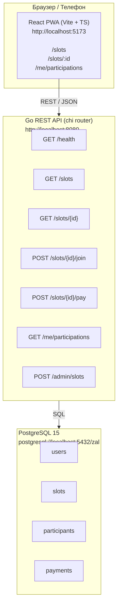

# Mermaid диаграммы

## Общая архитектура



## Поток данных: присоединение к слоту

```mermaid
sequenceDiagram
    participant B as Браузер
    participant A as API handler (participation.Join)
    participant D as База данных

    B->>A: POST /slots/{id}/join<br/>X-User-Token: &lt;token&gt;
    A->>D: BEGIN TRANSACTION
    A->>D: SELECT COUNT(*) FROM participants<br/>WHERE slot_id = $1 AND status IN ('RESERVED','PAID')<br/>FOR UPDATE
    D-->>A: count
    alt count >= slot.capacity
        A-->>B: 409 Conflict
    else Есть свободные места
        A->>D: INSERT INTO participants (slot_id, user_id, status='RESERVED')
        A->>D: COMMIT
        A-->>B: 201 Created { participant_id, status: "RESERVED" }
    end
```
